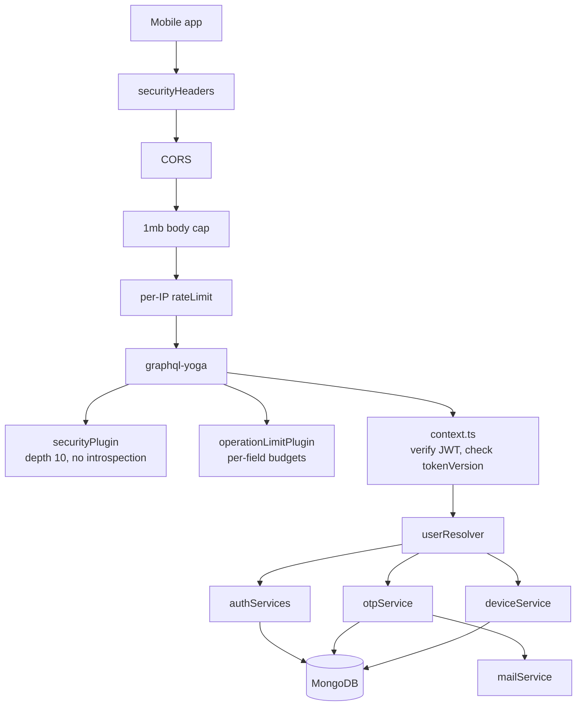
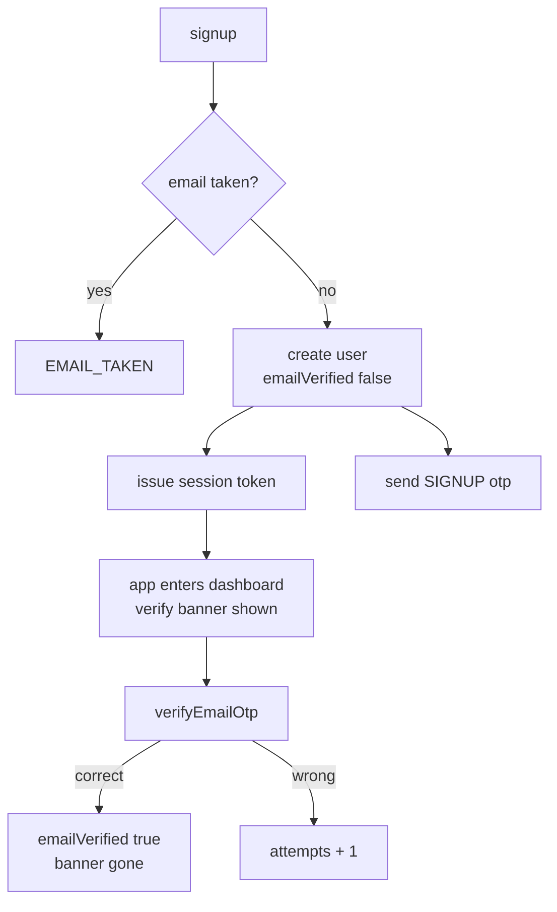
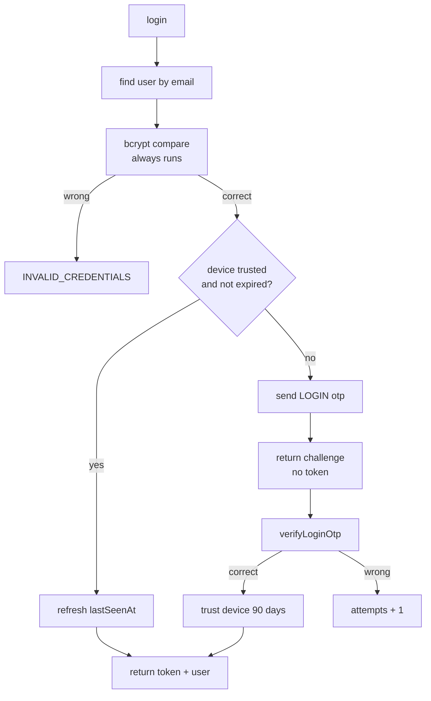
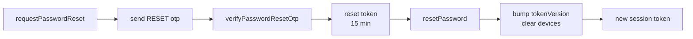
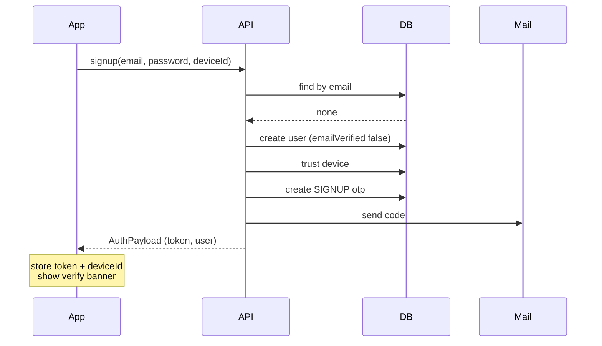
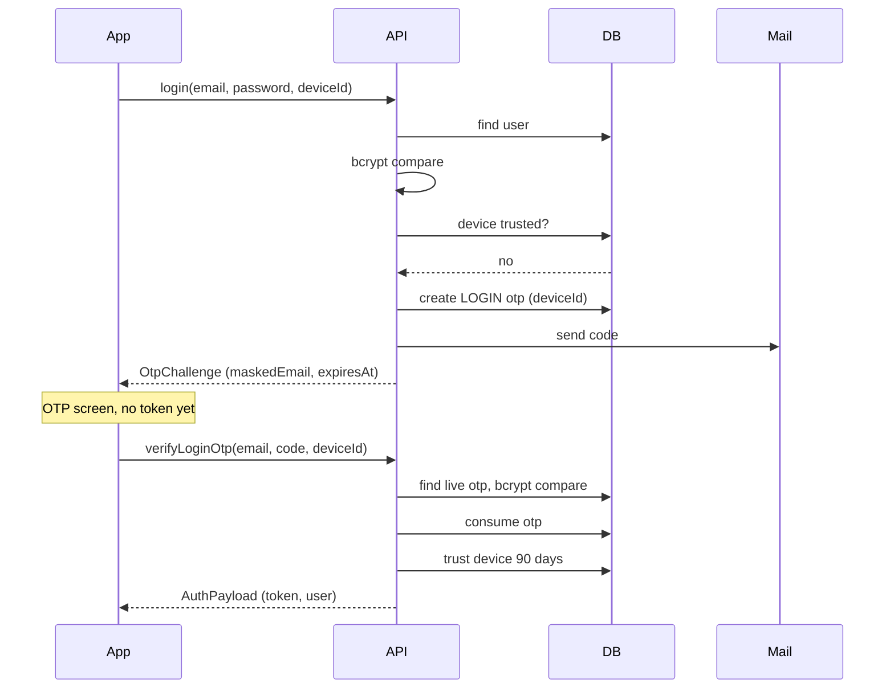
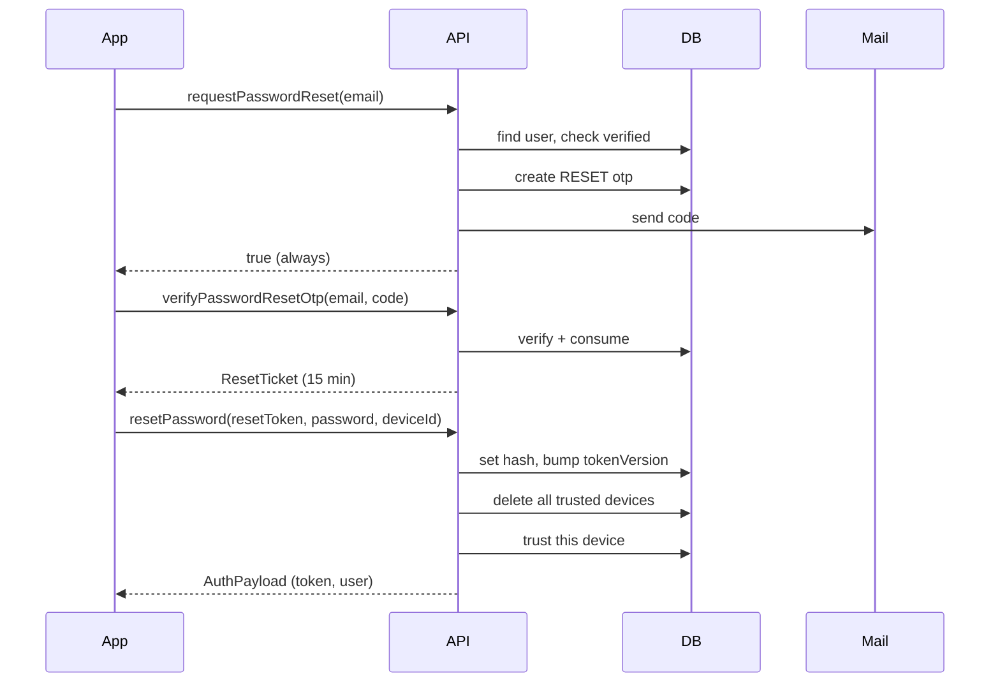
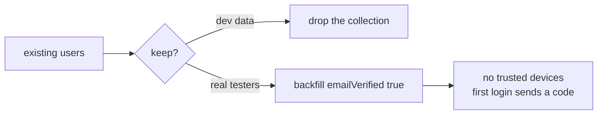

# Imara Afya — Auth System Design

**As of 18 September 2026 · Idriss Murenga · Imara Company**

MVP authentication for the Imara Afya backend — Node/TypeScript, Express, graphql-yoga, Mongoose. Replaces the current password-only auth with email OTP verification.

---

## Table of contents

1. [Scope and decisions](#1-scope-and-decisions)
2. [Architecture overview](#2-architecture-overview)
3. [Data model](#3-data-model)
4. [Token design](#4-token-design)
5. [Signup and email verification](#5-signup-and-email-verification)
6. [Login and device trust](#6-login-and-device-trust)
7. [Password reset](#7-password-reset)
8. [Password change](#8-password-change)
9. [Sequence diagrams](#9-sequence-diagrams)
10. [OTP rules](#10-otp-rules)
11. [Rate limiting](#11-rate-limiting)
12. [GraphQL API surface](#12-graphql-api-surface)
13. [Error codes](#13-error-codes)
14. [Email templates](#14-email-templates)
15. [Client integration](#15-client-integration)
16. [Implementation map](#16-implementation-map)
17. [Migration from the current auth](#17-migration-from-the-current-auth)
18. [Test checklist](#18-test-checklist)
19. [Open items and risks](#19-open-items-and-risks)

---

## 1. Scope and decisions

Auth covers account creation, email verification, session issue and renewal, password change and password reset. Nothing else moves through this module.

Four decisions are locked:

| Decision | Choice | Reason |
| --- | --- | --- |
| OTP on login | New or untrusted device only | Password alone on a known phone; a code only when the device is unrecognised |
| Email verification | Does not block signup | An OTP that never arrives must not trap a new user on the first screen |
| OTP channel | Email now, schema ready for SMS | Email is not the primary channel in Burundi; the column exists from day one |
| Session | 7-day sliding token, 30-day origin cap | Already built and working; OTP layers on top of it, nothing replaces it |

Out of scope for the MVP: social login, magic links, biometric unlock, TOTP authenticator apps, and account recovery without email access.

---

## 2. Architecture overview

Where auth sits in the request pipeline, and what each piece owns.



### New service files

| File | Owns |
| --- | --- |
| `services/otpService.ts` | Generate, hash, store, verify, consume, resend, cooldown |
| `services/deviceService.ts` | Trust lookup, trust grant, expiry, revoke, list |
| `services/authServices.ts` | Existing — gains reset-token sign and verify |
| `services/mailService.ts` | Existing — gains the OTP template |

Nothing in `otpService` or `deviceService` imports GraphQL or `Context`. They take plain arguments and throw plain errors; the resolver translates those into `GraphQLError` codes. Same separation the repo already keeps between `datetime.ts`, `validation.ts` and `resolverHelpers.ts`.

---

## 3. Data model

Three collections: `user` gains four fields, `otp` and `trustedDevice` are new.

### user — fields added

| Field | Type | Default | Purpose |
| --- | --- | --- | --- |
| `emailVerified` | Boolean | `false` | Set once a SIGNUP code is consumed |
| `emailVerifiedAt` | Date | null | Audit trail, and evidence for a support request |
| `failedPasswordAttempts` | Number | 0 | Feeds the five-attempt lockout on change password |
| `tokenVersion` | Number | 0 | Already present; bumped on logout, password change, password reset |

Email stays unique and lowercased on write. `passwordHash` stays bcrypt.

### otp — new collection

| Field | Type | Notes |
| --- | --- | --- |
| `user` | ObjectId ref User | Indexed |
| `codeHash` | String | bcrypt of the 6 digits, never the digits |
| `purpose` | String enum | `SIGNUP` / `LOGIN` / `RESET` |
| `channel` | String enum | `EMAIL` now, `SMS` later — no migration needed |
| `deviceId` | String, optional | Set on LOGIN codes; the device this code will trust |
| `expiresAt` | Date | Now + 10 minutes; TTL index drops the row |
| `attempts` | Number | Verify attempts spent, ceiling 5 |
| `consumedAt` | Date, null | Non-null means dead; never reusable |
| `ip` | String | Where it was requested from |
| `createdAt` | Date | Drives the resend cooldown |

Indexes: `{ user: 1, purpose: 1, consumedAt: 1 }` for the lookup on verify, and a TTL index on `expiresAt` so expired codes clear themselves without a cron job.

One live code per user per purpose. Requesting a new one consumes the old one, so a user reading the newest email is never fighting a stale code.

### trustedDevice — new collection

| Field | Type | Notes |
| --- | --- | --- |
| `user` | ObjectId ref User | Indexed |
| `deviceId` | String | Client-generated UUID, stored in the phone's secure storage |
| `label` | String | "Android 14 · Tecno" — shown in settings so a user can recognise it |
| `lastSeenAt` | Date | Refreshed on every successful login |
| `expiresAt` | Date | `lastSeenAt` + 90 days; TTL index |

Index: `{ user: 1, deviceId: 1 }` unique.

Both new models carry `user: { ref: "User" }`, so both must be added to `USER_OWNED` in `accountService.ts` or `assertPurgeCoverage()` refuses to boot.

---

## 4. Token design

Two token kinds, both HS256 with a pinned issuer, verified with the algorithm and issuer pinned on the way back in.

### Session token

| Claim | Meaning |
| --- | --- |
| `sub` | User id |
| `v` | The user's `tokenVersion` at issue time |
| `o` | Session origin — when the password was last actually typed |
| `iss` | Pinned issuer string |
| `exp` | Issue + 7 days |

`context.ts` rejects any token whose `v` is behind the user's current `tokenVersion`. Bumping `tokenVersion` therefore revokes every token ever issued, instantly — that is what logout, password change and password reset each do.

`refreshSession` mints a new 7-day token but keeps the original `o`. Once `o` is more than 30 days old the refresh is refused and the password must be typed again. An already-issued token still works until its own `exp`, so a refresh cap is not a logout.

### Reset token

Issued only by `verifyPasswordResetOtp`, and it is not a session token.

| Claim | Meaning |
| --- | --- |
| `sub` | User id |
| `purpose` | `PASSWORD_RESET` — checked explicitly, so it cannot be used as a session |
| `exp` | Issue + 15 minutes |

It exists so the OTP is not re-sent with the new password. The user proves the code once, gets a short-lived ticket, then sets the password. `resetPassword` accepts nothing else, and a session token presented in its place is refused on the `purpose` claim.

On a successful reset: `tokenVersion` bumps, every trusted device for that user is deleted, and a fresh session token is returned. Someone who resets a password because they think the account was taken should not leave the attacker's phone trusted.

---

## 5. Signup and email verification

Signup returns a working session token immediately. Verification happens after, not before.



The user is inside the app one screen after signup. A dismissible banner asks them to verify, and `me` carries `emailVerified` so the app knows whether to show it.

### What an unverified account cannot do

| Action | Unverified |
| --- | --- |
| Log water, steps, sleep, weight, check-in | Allowed |
| Read own data | Allowed |
| Request a password reset | Blocked — the address is unproven |
| Trust a new device | Blocked — must verify first |
| Change email | Blocked |

Tracking works unverified because a user who cannot log water on day one does not come back on day two. Reset is blocked because sending a recovery code to an unproven address is how an account gets handed to a typo.

### Rules

- Email is lowercased and trimmed before the uniqueness check.
- Password validated server-side against `validation.ts` before the user document is created.
- If the OTP email fails to send, signup still succeeds. The failure is logged, the banner offers Resend.
- After 7 days unverified, the banner stops being dismissible. Still not a lockout.

---

## 6. Login and device trust

Login takes email, password and `deviceId`. A trusted device gets a token; anything else gets a code.



`login` returns a union, not always an `AuthPayload`. The app branches on which it got.

### deviceId

A UUID v4 generated once by the app on first launch and written to secure storage — Keychain on iOS, EncryptedSharedPreferences on Android. Never `AsyncStorage`, or clearing the cache logs everyone out into an OTP loop.

It is an opaque identifier, not a security boundary. A caller can send any string they like; all it does is decide whether an OTP is required. The password is still the thing being checked.

### Timing safety

The existing behaviour stays: bcrypt compare runs against a dummy hash even when no user matches the email, so response time cannot reveal who has an account. `INVALID_CREDENTIALS` is returned for both a wrong password and an unknown email, with identical wording.

### Trust window

90 days from `lastSeenAt`, refreshed on every successful login. A phone used weekly never sees a code again. A phone left untouched for three months asks once.

Devices are listed in settings with label and last-seen date, and any one can be revoked. Revoking a device does not end its current session — it means the next login from it needs a code. To kill a session, log out or reset the password.

---

## 7. Password reset

Three calls: request a code, exchange the code for a reset ticket, set the password.



`requestPasswordReset` always returns `true`, whether or not the email exists. An endpoint that says "no such account" is a free account-enumeration tool.

An unverified email cannot request a reset — it returns `true` as well, and sends nothing.

On success the user is logged in directly. Making someone reset a password and then type it again immediately is friction with no security value.

---

## 8. Password change

Authenticated, current password required, no OTP. The user already proved possession of the session.

| Rule | Behaviour |
| --- | --- |
| Wrong current password | `failedPasswordAttempts` + 1 |
| Five wrong attempts | Change is refused until a reset is done; app offers the email reset |
| Correct password | Counter cleared to 0 |
| Confirmation mismatch | Caught before an attempt is spent |
| New password equals old | Refused |
| On success | `tokenVersion` bumps, new token returned, other devices logged out |

The lockout is per account, not per IP. Someone who cannot remember the password will not remember it on the sixth try, and the reset path is always visible so nobody has to fail five times to find it.

Trusted devices survive a password change. The user is choosing to rotate a password they know, which is not the same signal as a reset.

---

## 9. Sequence diagrams

Call-by-call, including what the client stores at each step.

### Signup



### Login from a new device



### Password reset



The reset path ends logged in on the device that did the reset, with every other device required to log in again.

---

## 10. OTP rules

One table, and every rule here is enforced server-side.

| Rule | Value | Reason |
| --- | --- | --- |
| Format | 6 digits, `crypto.randomInt` | Never `Math.random` — it is predictable |
| Lifetime | 10 minutes | Long enough for slow email on 2G, short enough to matter |
| Storage | bcrypt hash | A leaked database must not contain live codes |
| Uses | Single | `consumedAt` set the moment it verifies |
| Verify attempts | 5, then the code dies | 6 digits is a million guesses; 5 attempts makes brute force useless |
| Resend cooldown | 60 seconds | Stops a tapped-twice button spending the hourly budget |
| Resends per hour | 3 per user per purpose | Caps mail cost and abuse |
| Live codes | One per user per purpose | A new request consumes the old code |
| Expired rows | TTL index on `expiresAt` | Self-cleaning, no cron job |
| Comparison | bcrypt compare | Constant-time by construction |

When a code dies from too many attempts, the error says so explicitly and the app offers Resend. Silently rejecting a correct code the user typed on the sixth try is how a support ticket gets written.

The email body carries the code in the subject line as well. On a feature phone or a notification preview, that is often all the user will see.

---

## 11. Rate limiting

New entries for the `RULES` table in `operationLimit.ts`. Unlisted fields fall through to the default read/write budget, which is far too generous for these.

| Field | Burst | Sustained | Key |
| --- | --- | --- | --- |
| `signup` | 3 / 10 min | 10 / day | IP |
| `login` | 5 / 1 min | 30 / hour | IP + email |
| `verifyEmailOtp` | 5 / 1 min | 20 / hour | user |
| `verifyLoginOtp` | 5 / 1 min | 20 / hour | IP + email |
| `verifyPasswordResetOtp` | 5 / 1 min | 20 / hour | IP + email |
| `resendEmailOtp` | 1 / 1 min | 3 / hour | user |
| `resendLoginOtp` | 1 / 1 min | 3 / hour | IP + email |
| `requestPasswordReset` | 1 / 1 min | 3 / hour | IP + email |
| `resetPassword` | 5 / 10 min | 10 / hour | IP |
| `changePassword` | 5 / 10 min | 20 / hour | user |

The email key is the important addition. Every current budget keys on `req.ip` or user id, but an unauthenticated attacker walking a list of addresses has no user id and can rotate IPs. Keying on the submitted email as well caps the attempt count per target account regardless of where it comes from.

Hash the email before using it as a bucket key, so the in-memory map does not hold plaintext addresses.

Both limiters still share the in-memory buckets in `rateLimit.ts`. That means counts reset on restart and are not shared across instances — a known, deliberate limitation while one instance runs. Swap `hit()` for Redis before a second instance, not before.

---

## 12. GraphQL API surface

Follows the repo's four-file split: `types/user.ts`, `queries/user.ts`, `mutation/user.ts`, `resolvers/userResolver.ts`, plus arg types in `utils/types.ts` and both barrel files.

### Types

```graphql
type AuthPayload {
  token: String!
  user: User!
}

type OtpChallenge {
  challenge: Boolean!
  purpose: String!
  expiresAt: String!
  maskedEmail: String!
}

union LoginResult = AuthPayload | OtpChallenge

type ResetTicket {
  resetToken: String!
  expiresAt: String!
}

type TrustedDevice {
  id: ID!
  label: String!
  lastSeenAt: String!
  expiresAt: String!
  current: Boolean!
}
```

`maskedEmail` is `i****s@gmail.com` — enough for the user to confirm which address to check, not enough to harvest.

### Inputs

```graphql
input SignUpInput {
  email: String!
  password: String!
  deviceId: String!
  deviceLabel: String
}

input LoginInput {
  email: String!
  password: String!
  deviceId: String!
  deviceLabel: String
}

input VerifyOtpInput {
  code: String!
  deviceId: String
}

input VerifyResetOtpInput {
  email: String!
  code: String!
}

input ResetPasswordInput {
  resetToken: String!
  password: String!
  deviceId: String!
}

input ChangePasswordInput {
  currentPassword: String!
  newPassword: String!
}

input DeleteAccountInput {
  password: String!
}
```

### Queries

```graphql
me: User!
myTrustedDevices: [TrustedDevice!]!
```

### Mutations

```graphql
signup(input: SignUpInput!): AuthPayload!
login(input: LoginInput!): LoginResult!
verifyEmailOtp(input: VerifyOtpInput!): User!
resendEmailOtp: Boolean!
verifyLoginOtp(email: String!, input: VerifyOtpInput!): AuthPayload!
resendLoginOtp(email: String!): Boolean!
requestPasswordReset(email: String!): Boolean!
verifyPasswordResetOtp(input: VerifyResetOtpInput!): ResetTicket!
resendPasswordResetOtp(email: String!): Boolean!
resetPassword(input: ResetPasswordInput!): AuthPayload!
changePassword(input: ChangePasswordInput!): AuthPayload!
refreshSession: AuthPayload!
logout: Boolean!
revokeTrustedDevice(id: ID!): Boolean!
deleteAccount(input: DeleteAccountInput!): Boolean!
```

15 mutations, 2 queries. `verifyEmailOtp` and `resendEmailOtp` are authenticated; everything in the login and reset paths is not.

The union on `login` is the one schema change the app must handle carefully — it needs an inline fragment on both members and a branch on which came back.

---

## 13. Error codes

Every failure is a `GraphQLError` with `extensions: { code }`. The app branches on the code, never on the message.

| Code | Raised by | Meaning for the user |
| --- | --- | --- |
| `EMAIL_TAKEN` | signup | That address already has an account |
| `INVALID_EMAIL` | signup, reset | Not a valid address |
| `WEAK_PASSWORD` | signup, reset, change | Fails the password rules |
| `INVALID_CREDENTIALS` | login | Wrong email or password — deliberately ambiguous |
| `EMAIL_NOT_VERIFIED` | requestPasswordReset, verifyLoginOtp | Verify the address first |
| `OTP_NOT_FOUND` | every verify | No live code — request a new one |
| `OTP_EXPIRED` | every verify | Past 10 minutes |
| `OTP_INCORRECT` | every verify | Wrong digits, attempts remain |
| `OTP_ATTEMPTS_EXCEEDED` | every verify | Code is dead, request a new one |
| `OTP_COOLDOWN` | every resend | Wait before asking again |
| `OTP_RESEND_LIMIT` | every resend | Hourly cap hit |
| `OTP_SEND_FAILED` | signup, resend, reset | Mail provider refused — the only honest response |
| `INVALID_RESET_TOKEN` | resetPassword | Expired or wrong-purpose ticket |
| `WRONG_PASSWORD` | changePassword, deleteAccount | Current password incorrect |
| `PASSWORD_ATTEMPTS_EXCEEDED` | changePassword | Five failures — use the email reset |
| `PASSWORD_UNCHANGED` | changePassword, reset | New password equals the old one |
| `SESSION_EXPIRED` | refreshSession | 30-day origin cap reached — log in again |
| `TOKEN_REVOKED` | any authenticated field | `tokenVersion` behind — log in again |
| `DEVICE_NOT_FOUND` | revokeTrustedDevice | Already gone |
| `RATE_LIMITED` | any | Too many attempts |

`OTP_NOT_FOUND`, `OTP_EXPIRED` and `OTP_ATTEMPTS_EXCEEDED` all resolve to the same user action — request a new code — but are separate codes so the app can word the message correctly and so the logs distinguish a slow user from an attacker.

Every resolver's catch block ends with `rethrow(error, message, code, invalidMessage?)` as the last line, per the existing convention.

---

## 14. Email templates

Three templates, one per purpose, in the user's language. The code goes in the subject line as well as the body — on a notification preview that is often all the user sees.

### Subject lines

| Purpose | English | Français | Kiswahili |
| --- | --- | --- | --- |
| SIGNUP | `123456 is your Imara Afya code` | `123456 est votre code Imara Afya` | `123456 ni namba yako ya Imara Afya` |
| LOGIN | `123456 — new sign-in to Imara Afya` | `123456 — nouvelle connexion Imara Afya` | `123456 — kuingia kupya Imara Afya` |
| RESET | `123456 — reset your Imara Afya password` | `123456 — réinitialiser votre mot de passe` | `123456 — badilisha nywila yako` |

### Body rules

- The code appears once, large, on its own line. No other number anywhere in the email.
- State the expiry in minutes, not as a timestamp — timezones confuse, "10 minutes" does not.
- LOGIN and RESET emails carry one line: *If this wasn't you, change your password.* SIGNUP does not, because nothing has been compromised yet.
- No tracking pixels, no marketing footer, no unsubscribe link. These are transactional; a recovery code that lands in Promotions is a failed recovery.
- Plain text alternative always sent alongside the HTML. Entry-level Android mail clients handle it better, and it renders on 2G.

Kirundi is not included. The strings are machine-drafted and unreviewed; a mistranslated security email is worse than an English one the user can puzzle out.

---

## 15. Client integration

What the React Native app must do, in the order it must do it.

### On first launch, before any auth call

Generate a UUID v4, write it to secure storage, read it on every subsequent launch. `expo-secure-store`, not `AsyncStorage`. If the read fails, generate a new one — the cost is one OTP, not a broken app.

### The login branch

```graphql
mutation Login($input: LoginInput!) {
  login(input: $input) {
    __typename
    ... on AuthPayload { token user { id emailVerified } }
    ... on OtpChallenge { challenge purpose expiresAt maskedEmail }
  }
}
```

The app switches on `__typename`. `AuthPayload` means store the token and go to the dashboard; `OtpChallenge` means push the OTP screen with `maskedEmail` and a countdown to `expiresAt`.

### OTP screen behaviour

| Element | Requirement |
| --- | --- |
| Input | Six single-digit boxes, numeric keyboard, auto-advance |
| Autofill | `textContentType="oneTimeCode"` on iOS, `autoComplete="sms-otp"` on Android |
| Paste | Pasting six digits fills all boxes at once |
| Submit | Automatic once the sixth digit lands — no Verify button tap |
| Resend | Disabled with a 60-second countdown, then enabled |
| Expiry | Countdown to `expiresAt`; at zero, the input greys and Resend is the only action |
| Errors | `OTP_INCORRECT` clears the boxes and keeps focus; `OTP_ATTEMPTS_EXCEEDED` clears and switches to Resend |

### Offline

Auth is the one part of the app that cannot work offline. Every other screen reads local state first. The auth screens must say plainly that a connection is needed rather than showing a spinner that never resolves — on 2G a request can hang for 30 seconds before anything happens, so set an explicit timeout and a retry.

### Token storage

Session token in secure storage, never `AsyncStorage`. Cleared on logout, on `TOKEN_REVOKED`, and on `SESSION_EXPIRED`. The `deviceId` is *not* cleared on logout — that is the whole point of it.

---

## 16. Implementation map

Every file the change touches, in build order. The repo's feature split means a new field is invisible unless both barrels are edited.

| # | File | Change |
| --- | --- | --- |
| 1 | `models/otp.ts` | New — schema, TTL index, compound index |
| 2 | `models/trustedDevice.ts` | New — schema, unique index, TTL index |
| 3 | `models/user.ts` | Add `emailVerified`, `emailVerifiedAt`, `failedPasswordAttempts` |
| 4 | `services/accountService.ts` | Add both models to `USER_OWNED` |
| 5 | `utils/validation.ts` | Add `isValidOtpCode`, `isValidDeviceId` |
| 6 | `services/otpService.ts` | New — issue, verify, consume, resend guard |
| 7 | `services/deviceService.ts` | New — isTrusted, trust, revoke, list |
| 8 | `services/mailService.ts` | Add `sendOtpEmail` template |
| 9 | `services/authServices.ts` | Add `signResetToken`, `verifyResetToken` |
| 10 | `graphql/schemas/types/user.ts` | Add `OtpChallenge`, `LoginResult`, `ResetTicket`, `TrustedDevice`, new inputs |
| 11 | `graphql/schemas/queries/user.ts` | Add `myTrustedDevices` |
| 12 | `graphql/schemas/mutation/user.ts` | Add the 8 new mutations |
| 13 | `utils/types.ts` | Add arg types for every new field |
| 14 | `graphql/resolvers/userResolver.ts` | Implement all of it, plus the union resolver |
| 15 | `middleware/operationLimit.ts` | Add the 10 new `RULES` entries |
| 16 | `graphql/schemas/index.ts` | Confirm the union type string is interpolated |
| 17 | `config/envConf.ts` | Add `OTP_TTL_MINUTES`, `DEVICE_TRUST_DAYS`, `RESET_TOKEN_MINUTES` |

The union needs a `__resolveType` on `LoginResult` in the resolver barrel — it is not a `Query` or `Mutation` key, so spreading alone will not pick it up. This is the one place the existing barrel pattern does not cover the new code.

### Environment variables

| Var | Default | Notes |
| --- | --- | --- |
| `OTP_TTL_MINUTES` | 10 | |
| `OTP_MAX_ATTEMPTS` | 5 | |
| `OTP_RESEND_COOLDOWN_SECONDS` | 60 | |
| `OTP_RESENDS_PER_HOUR` | 3 | |
| `DEVICE_TRUST_DAYS` | 90 | |
| `RESET_TOKEN_MINUTES` | 15 | |
| `RESEND_API_KEY` | — | Existing |
| `RESEND_FROM` | — | Must be a verified domain before launch |

`envConf.ts` throws on a missing required value at boot, which is the right behaviour here too — a server running without `RESEND_FROM` in production is a server that cannot sign anyone up.

---

## 17. Migration from the current auth

The app is unreleased, so there are no production users to migrate. That removes the hard part and leaves one decision: what happens to accounts already in the development database.



Backfilling `emailVerified: true` for existing accounts is correct — they were created before verification existed, and forcing a verification they never agreed to would lock testers out of their own data. Nobody gets a trusted device, so everyone's next login sends one code. That is the intended behaviour, not a migration bug.

### Order of deployment

1. Ship the models and services with no schema changes. Nothing is reachable yet.
2. Verify the Resend domain and send a test OTP to a real address.
3. Ship the schema and resolvers. `login` now returns a union — **this is a breaking change** and the app must ship at the same time or first.
4. Add the `RULES` entries.
5. Backfill `emailVerified`.

Step 3 is the only one that cannot be rolled back independently. An old app build against the new schema will fail to parse the `login` response. Since nothing is published yet this costs nothing — after launch it would need a versioned field.

---

## 18. Test checklist

There is no test runner configured in `package.json`. Until there is, this is the manual pass — every row is a case that has broken a real OTP implementation somewhere.

### Happy paths

- [ ] Signup returns a token and the dashboard loads before verification
- [ ] Signup OTP verifies and the banner disappears
- [ ] Login from the signup device returns a token with no OTP
- [ ] Login from a fresh `deviceId` returns a challenge, not a token
- [ ] Login OTP verifies and the device is trusted
- [ ] Second login from that device skips the OTP
- [ ] Reset produces a ticket, then a new password, then a session

### Failure paths

- [ ] Wrong code increments attempts and leaves the code alive
- [ ] Sixth wrong attempt kills the code and says so
- [ ] Expired code is rejected after 10 minutes
- [ ] A consumed code cannot be replayed
- [ ] Resend within 60 seconds is refused
- [ ] Fourth resend in an hour is refused
- [ ] Requesting a new code kills the previous one
- [ ] A reset token cannot be used as a session token
- [ ] A session token cannot be used as a reset token
- [ ] Reset clears every trusted device
- [ ] Password change bumps `tokenVersion` and old tokens stop working

### Security

- [ ] `requestPasswordReset` returns `true` for an address that does not exist
- [ ] Login response time is the same for unknown email and wrong password
- [ ] Codes are stored hashed — check the collection directly
- [ ] Rate limits key on email, verified by rotating IP with the same address
- [ ] Introspection is off with `NODE_ENV=production`
- [ ] A second account cannot verify the first account's code
- [ ] Account deletion removes rows from `otp` and `trustedDevice`

### Field conditions

- [ ] Full flow on 2G with the network throttled
- [ ] OTP autofill works on Android from the SMS-style notification
- [ ] Airplane mode mid-flow shows a connection error, not a hung spinner
- [ ] App killed on the OTP screen, reopened — the code still works

---

## 19. Open items and risks

### Blocks launch

**Resend delivers only to the account owner's address.** Until a domain is verified with Resend, every OTP to a real user silently fails. This was a minor gap when only password reset used email. With OTP on signup and new-device login it is the single thing that makes the auth system work or not work. Buy the domain, verify it, then build.

**Password reset deep link is unfixed.** Already on the open blockers list. With an OTP flow the link matters less — the user types six digits rather than following a URL — which is an argument for OTP-only reset and dropping the deep link entirely.

### Watch

**Email is not the primary channel in Burundi.** SMS is. The `channel` column on `otp` exists so adding SMS is a provider integration, not a migration. Worth revisiting after the first hundred users: if signup verification completion sits below roughly 60%, email is the reason.

**SMS needs a second provider.** Resend is email only. Twilio supports Burundi but has no two-way SMS and no long or short codes, and since 1 August 2026 the Lumitel network blocks unregistered alphanumeric sender IDs — registration takes about three weeks. Africa's Talking is the regional alternative. Either way it needs a phone number field, which the MVP does not have.

**In-memory rate limit buckets reset on restart.** A deploy clears every counter, including a brute-force attempt in progress. Acceptable at one instance; it is the first thing to move to Redis if abuse appears.

**Device trust is not a security boundary.** `deviceId` is caller-supplied. Someone who has a valid password and a stolen `deviceId` skips the OTP. The mitigation is that they need both, and the password is still checked — device trust reduces friction, it does not add a factor.

### Deferred to v2

- SMS as an OTP channel
- TOTP authenticator support
- Change email address
- Login alerts by email on a new device
- Account recovery without email access

---

*Imara Afya — Imara Company · Bujumbura, Burundi*
